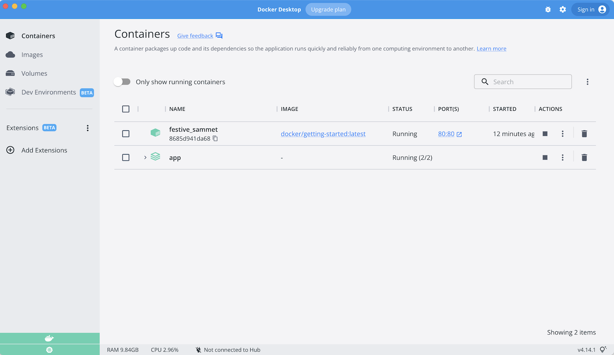
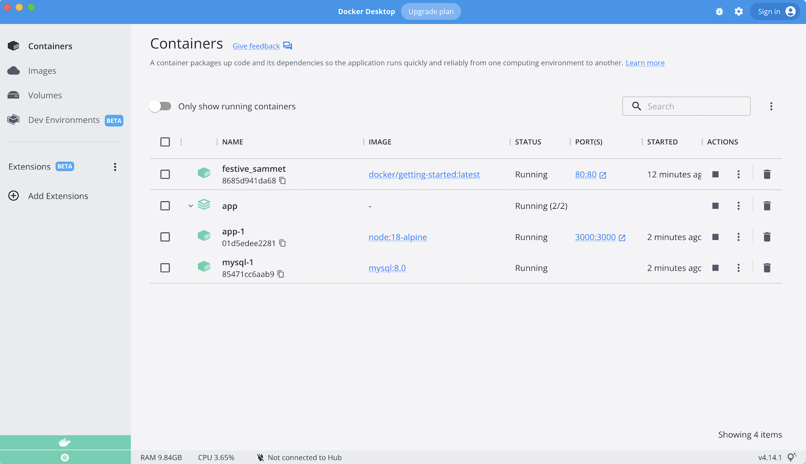

[Docker Compose](https://docs.docker.com/compose/) is a tool that was developed to help define and
share multi-container applications. With Compose, we can create a YAML file to define the services
and with a single command, can spin everything up or tear it all down. 

The _big_ advantage of using Compose is you can define your application stack in a file, keep it at the root of
your project repo (it's now version controlled), and easily enable someone else to contribute to your project. 
Someone would only need to clone your repo and start the compose app. In fact, you might see quite a few projects
on GitHub/GitLab doing exactly this now.

So, how do we get started?

## Installing Docker Compose

Since you installed Docker Desktop/Toolbox for either Windows or Mac, you already have Docker Compose!
Play-with-Docker instances already have Docker Compose installed as well. If you are on 
a Linux machine, you will need to install Docker Compose using 
[the instructions here](https://docs.docker.com/compose/install/). 

After installation, you should be able to run the following and see version information.

```bash
docker-compose version
```


## Creating our Compose File

1. At the root of the app project, create a file named `docker-compose.yml`.

1. In the compose file, we'll start off by defining the schema version. In most cases, it's best to use 
   the latest supported version. You can look at the [Compose file reference](https://docs.docker.com/compose/compose-file/)
   for the current schema versions and the compatibility matrix.

    ```yaml
    version: "3.7"
    ```

1. Next, we'll define the list of services (or containers) we want to run as part of our application.

    ```yaml hl_lines="3"
    version: "3.7"

    services:
    ```

And now, we'll start migrating a service at a time into the compose file.


## Defining the App Service

To remember, this was the command we were using to define our app container.

```bash
docker run -dp 3000:3000 \
  -w /app -v $PWD:/app \
  --network todo-app \
  -e MYSQL_HOST=mysql \
  -e MYSQL_USER=root \
  -e MYSQL_PASSWORD=secret \
  -e MYSQL_DB=todos \
  node:12-alpine \
  sh -c "yarn install && yarn run dev"
```

1. First, let's define the service entry and the image for the container. We can pick any name for the service. 
   The name will automatically become a network alias, which will be useful when defining our MySQL service.

    ```yaml hl_lines="4 5"
    version: "3.7"

    services:
      app:
        image: node:12-alpine
    ```

1. Typically, you will see the command close to the `image` definition, although there is no requirement on ordering.
   So, let's go ahead and move that into our file.

    ```yaml hl_lines="6"
    version: "3.7"

    services:
      app:
        image: node:12-alpine
        command: sh -c "yarn install && yarn run dev"
    ```


1. Let's migrate the `-p 3000:3000` part of the command by defining the `ports` for the service. We will use the
   [short syntax](https://docs.docker.com/compose/compose-file/#short-syntax-1) here, but there is also a more verbose 
   [long syntax](https://docs.docker.com/compose/compose-file/#long-syntax-1) available as well.

    ```yaml hl_lines="7 8"
    version: "3.7"

    services:
      app:
        image: node:12-alpine
        command: sh -c "yarn install && yarn run dev"
        ports:
          - 3000:3000
    ```

1. Next, we'll migrate both the working directory (`-w /app`) and the volume mapping (`-v $PWD:/app`) by using
   the `working_dir` and `volumes` definitions. Volumes also has a [short](https://docs.docker.com/compose/compose-file/#short-syntax-3) and [long](https://docs.docker.com/compose/compose-file/#long-syntax-3) syntax.

    One advantage of Docker Compose volume definitions is we can use relative paths from the current directory.

    ```yaml hl_lines="9 10 11"
    version: "3.7"

    services:
      app:
        image: node:12-alpine
        command: sh -c "yarn install && yarn run dev"
        ports:
          - 3000:3000
        working_dir: /app
        volumes:
          - ./:/app
    ```

1. Finally, we need to migrate the environment variable definitions using the `environment` key.

    ```yaml hl_lines="12 13 14 15 16"
    version: "3.7"

    services:
      app:
        image: node:12-alpine
        command: sh -c "yarn install && yarn run dev"
        ports:
          - 3000:3000
        working_dir: /app
        volumes:
          - ./:/app
        environment:
          MYSQL_HOST: mysql
          MYSQL_USER: root
          MYSQL_PASSWORD: secret
          MYSQL_DB: todos
    ```

  
### Defining the MySQL Service

Now, it's time to define the MySQL service. The command that we used for that container was the following:

```bash
docker run -d \
  --network todo-app --network-alias mysql \
  -v todo-mysql-data:/var/lib/mysql \
  -e MYSQL_ROOT_PASSWORD=secret \
  -e MYSQL_DATABASE=todos \
  mysql:5.7
```

1. We will first define the new service and name it `mysql` so it automatically gets the network alias. We'll
   go ahead and specify the image to use as well.

    ```yaml hl_lines="6 7"
    version: "3.7"

    services:
      app:
        # The app service definition
      mysql:
        image: mysql:5.7
    ```

1. Next, we'll define the volume mapping. When we ran the container with `docker run`, the named volume was created
   automatically. However, that doesn't happen when running with Compose. We need to define the volume in the top-level
   `volumes:` section and then specify the mountpoint in the service config. By simply providing only the volume name,
   the default options are used. There are [many more options available](https://docs.docker.com/compose/compose-file/#volume-configuration-reference) though.

    ```yaml hl_lines="8 9 10 11 12"
    version: "3.7"

    services:
      app:
        # The app service definition
      mysql:
        image: mysql:5.7
        volumes:
          - todo-mysql-data:/var/lib/mysql
    
    volumes:
      todo-mysql-data:
    ```

1. Finally, we only need to specify the environment variables.

    ```yaml hl_lines="10 11 12"
    version: "3.7"

    services:
      app:
        # The app service definition
      mysql:
        image: mysql:5.7
        volumes:
          - todo-mysql-data:/var/lib/mysql
        environment: 
          MYSQL_ROOT_PASSWORD: secret
          MYSQL_DATABASE: todos
    
    volumes:
      todo-mysql-data:
    ```

At this point, our complete `docker-compose.yml` should look like this:


```yaml
version: "3.7"

services:
  app:
    image: node:12-alpine
    command: sh -c "yarn install && yarn run dev"
    ports:
      - 3000:3000
    working_dir: /app
    volumes:
      - ./:/app
    environment:
      MYSQL_HOST: mysql
      MYSQL_USER: root
      MYSQL_PASSWORD: secret
      MYSQL_DB: todos

  mysql:
    image: mysql:5.7
    volumes:
      - todo-mysql-data:/var/lib/mysql
    environment: 
      MYSQL_ROOT_PASSWORD: secret
      MYSQL_DATABASE: todos

volumes:
  todo-mysql-data:
```


## Running our Application Stack

Now that we have our `docker-compose.yml` file, we can start it up!

1. Make sure no other copies of the app/db are running first (`docker ps` and `docker rm -f <ids>`).

1. Start up the application stack using the `docker-compose up` command. We'll add the `-d` flag to run everything in the
   background.

    ```bash
    docker-compose up -d
    ```

    When we run this, we should see output like this:

    ```plaintext
    Creating network "app_default" with the default driver
    Creating volume "app_todo-mysql-data" with default driver
    Creating app_app_1   ... done
    Creating app_mysql_1 ... done
    ```

    You'll notice that the volume was created as well as a network! By default, Docker Compose automatically creates a 
    network specifically for the application stack (which is why we didn't define one in the compose file).

1. Let's look at the logs using the `docker-compose logs -f` command. You'll see the logs from each of the services interleaved
    into a single stream. This is incredibly useful when you want to watch for timing-related issues. The `-f` flag "follows" the
    log, so will give you live output as it's generated.

    If you don't already, you'll see output that looks like this...

    ```plaintext
    mysql_1  | 2019-10-03T03:07:16.083639Z 0 [Note] mysqld: ready for connections.
    mysql_1  | Version: '5.7.27'  socket: '/var/run/mysqld/mysqld.sock'  port: 3306  MySQL Community Server (GPL)
    app_1    | Connected to mysql db at host mysql
    app_1    | Listening on port 3000
    ```

    The service name is displayed at the beginning of the line (often colored) to help distinguish messages. If you want to
    view the logs for a specific service, you can add the service name to the end of the logs command (for example,
    `docker-compose logs -f app`).

    !!! info "Pro tip - Waiting for the DB before starting the app"
        When the app is starting up, it actually sits and waits for MySQL to be up and ready before trying to connect to it.
        Docker doesn't have any built-in support to wait for another container to be fully up, running, and ready
        before starting another container. For Node-based projects, you can use the 
        [wait-port](https://github.com/dwmkerr/wait-port) dependency. Similar projects exist for other languages/frameworks.

1. At this point, you should be able to open your app and see it running. And hey! We're down to a single command!

## Seeing our App Stack in Docker Dashboard

If we look at the Docker Dashboard, we'll see that there is a group named **app**. This is the "project name" from Docker
Compose and used to group the containers together. By default, the project name is simply the name of the directory that the
`docker-compose.yml` was located in.



If you twirl down the app, you will see the two containers we defined in the compose file. The names are also a little
more descriptive, as they follow the pattern of `<project-name>_<service-name>_<replica-number>`. So, it's very easy to
quickly see what container is our app and which container is the mysql database.




## Tearing it All Down

When you're ready to tear it all down, simply run `docker-compose down` or hit the trash can on the Docker Dashboard 
for the entire app. The containers will stop and the network will be removed.

!!! warning "Removing Volumes"
    By default, named volumes in your compose file are NOT removed when running `docker-compose down`. If you want to
    remove the volumes, you will need to add the `--volumes` flag.

    The Docker Dashboard does _not_ remove volumes when delete the app stack.

Once torn down, you can switch to another project, run `docker-compose up` and be ready to contribute to that project! It really
doesn't get much simpler than that!


## Recap

In this section, we learned about Docker Compose and how it helps dramatically simply the defining and
sharing of multi-service applications. We created a Compose file by translating the commands we were
using into the appropriate compose format.

At this point, we're starting to wrap up the tutorial. However, there are a few best practices about
image building we want to cover, as there is a big issue with the Dockerfile we've been using. So,
let's take a look!